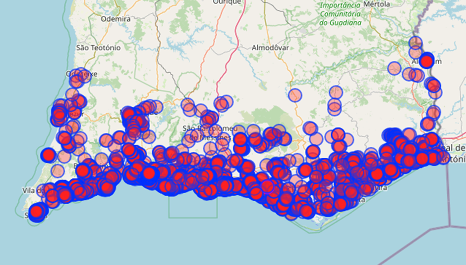

De acordo com a Associação Portuguesa de Profissionais de Piscinas (APP), existem cerca de **240 000 piscinas em Portugal**. Para obter uma aproximação regional, foi utilizado o *Overpass Turvo*, uma ferramenta de busca de dados open-source sobre mapas [OpenStreetMap](https://overpass-turbo.eu/) (OpenStreeMap,2025). A pesquisa no Algarve devolve cerca de 7 mil piscinas mapeadas.

Esta estimativa mostra como as piscinas privadas deixaram de ser um luxo raro e passaram a fazer parte do dia a dia de muitas famílias.

> No entanto, a associação lembra que as populações das zonas mais afectadas pela seca recorrem às piscinas para se “refrescar e obter níveis de conforto que não conseguiriam em outras circunstâncias”, o que ajuda a explicar o aumento da procura. 

## Algarve em destaque

O Algarve é uma das regiões com maior densidade de piscinas, muito ligada ao turismo e às casas de férias. Urbanizações, hotéis e alojamentos locais recorrem à piscina como argumento decisivo para atrair visitantes. 

> Nas regiões turísticas, como o Algarve, as piscinas são vistas como parte essencial da experiência de férias. 

